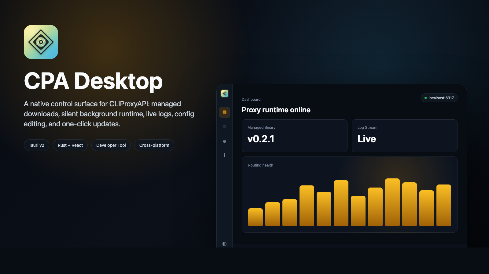
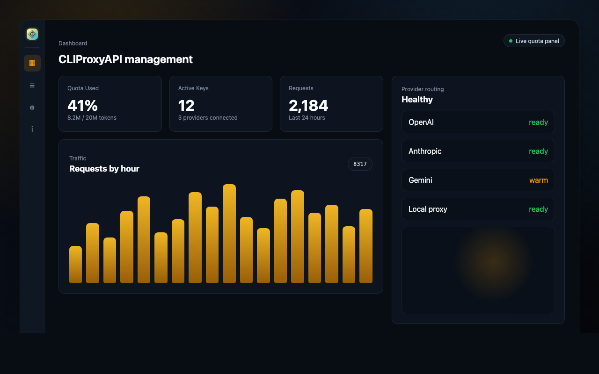
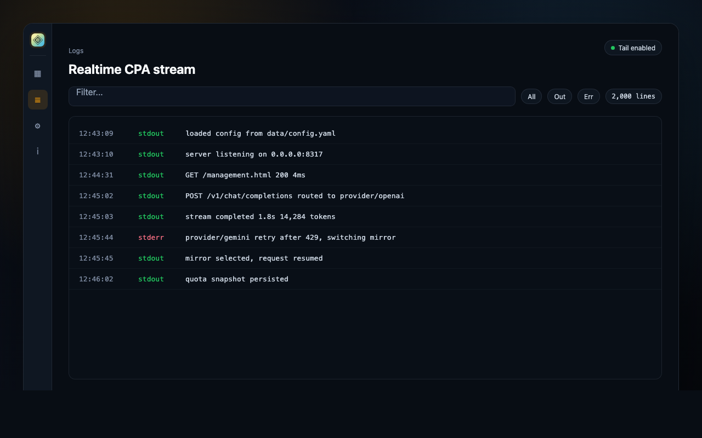
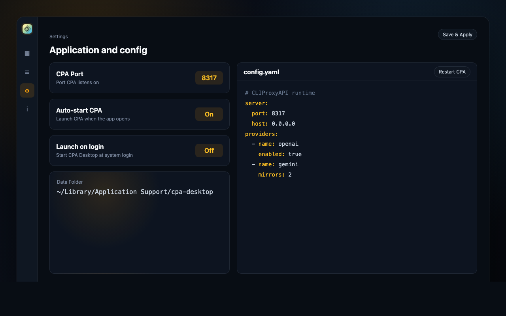

# CPA Desktop

A cross-platform desktop app for [CLIProxyAPI](https://github.com/router-for-me/CLIProxyAPI) built with **Tauri v2 + Rust + React**.



## Download

Grab the latest installer for your OS from the
[**Releases page**](https://github.com/Tendo33/CPA-Desktop/releases/latest).
Once installed, the app updates itself in place — see
[How it works](#how-it-works).

| Platform            | Recommended installer                       |
| ------------------- | ------------------------------------------- |
| Windows x64 / ARM64 | `*-setup.exe` (NSIS, supports auto-update)  |
| macOS Apple Silicon | `*_aarch64.dmg`                             |
| macOS Intel         | `*_x64.dmg`                                 |
| Linux x64 / ARM64   | `*.AppImage` or `*.deb`                     |

> Windows MSI bundles are also published if you need them for managed
> deployments, but the NSIS `.exe` is the default download.

## What it does

- **In-app self-update** — CPA Desktop ships its own auto-updater (Tauri updater plugin) and pulls new releases from GitHub
- **Auto-downloads & updates the CPA binary** from GitHub releases — no manual unzipping
- **Multiple install sources** — works alongside Homebrew, AUR/system packages, or fully custom paths (see below)
- **Silent background launch** — no black CMD window on Windows
- **Detects existing CPA** — if CPA is already running, it just connects to it
- **Real-time log viewer** — stdout/stderr streaming from the CPA process
- **Config editor** — edit `config.yaml` from within the app
- **System tray** — close to tray, double-click to restore
- **One-click CPA updates** — downloads the new binary and restarts CPA automatically

## Install sources

CPA Desktop can manage CPA itself or hand off to whichever package
manager already installed it. Switch sources from **Settings → Install
Source**; auto-detection populates the available choices.

| Source       | Binary                        | Config                                    | Update via                                  |
| ------------ | ----------------------------- | ----------------------------------------- | ------------------------------------------- |
| `Managed`    | `<appData>/bin/cli-proxy-api` | `<appData>/data/config.yaml`              | GitHub releases (handled in app)            |
| `Homebrew`   | `$(brew --prefix)/bin/...`    | `$(brew --prefix)/etc/cliproxyapi.conf`   | `brew upgrade cliproxyapi` (handled in app) |
| `SystemPath` | first match on `$PATH`        | `~/.cli-proxy-api/config.yaml` by default | your package manager (instructions only)    |
| `Custom`     | user-provided                 | user-provided                             | manual (instructions only)                  |

Notes:

- Homebrew users running `brew services start cliproxyapi` should
  `brew services stop` first — CPA Desktop spawns CPA itself and will
  conflict on the listening port otherwise.
- AUR / one-shot installer users should run
  `systemctl --user disable cli-proxy-api` for the same reason.
- For external sources we never overwrite files we don't own; the
  "Update" action shows the right command to run in your terminal.

## Product preview

These generated previews show CPA Desktop's shell and core workflows. The
dashboard panel is illustrative; the live CPA management webview is loaded from
CPA at runtime.

### Dashboard preview



### Logs preview



### Settings preview



## Code signing status

| Platform | Status                  | What you'll see on first launch                              |
| -------- | ----------------------- | ------------------------------------------------------------ |
| macOS    | Unsigned (TODO: notarize) | Gatekeeper warning. See the macOS notes below.               |
| Windows  | Unsigned (TODO: code-sign) | SmartScreen prompt → _More info_ → _Run anyway_              |
| Linux    | N/A                     | No equivalent to Gatekeeper; AppImage / `.deb` work as-is.   |

### macOS: clear the quarantine flag

Because the build is unsigned, macOS marks the downloaded `.dmg` (and the
`.app` it installs) as quarantined. Either of these one-line fixes works:

```bash
# Option A — clear quarantine on the .dmg before opening it
xattr -d com.apple.quarantine ~/Downloads/CPA.Desktop_*_aarch64.dmg
# (use ..._x64.dmg on Intel Macs)

# Option B — already installed? clear it on the app bundle
xattr -cr "/Applications/CPA Desktop.app"
```

After that, double-click the `.dmg` (or launch the app) as usual.

Maintainers: see `docs/SIGNING.md` for the planned signing pipeline and the
GitHub secrets required to enable it.

## Platforms

| Platform            | Installer            |
| ------------------- | -------------------- |
| Windows x64         | `.exe` / `.msi`      |
| Windows ARM64       | `.exe` / `.msi`      |
| macOS Apple Silicon | `.dmg`               |
| macOS Intel         | `.dmg`               |
| Linux x64           | `.AppImage` / `.deb` |
| Linux ARM64         | `.AppImage` / `.deb` |

## Development

### Prerequisites

- [Node.js](https://nodejs.org/) 18+
- [Rust](https://rustup.rs/) stable
- Tauri system dependencies — see [Tauri prerequisites](https://tauri.app/start/prerequisites/)

### Getting started

```bash
npm install
npm run tauri dev
```

### Build

```bash
npm run tauri build
```

Produces platform-native installers in `src-tauri/target/release/bundle/`.

## How it works

### First-run setup

The very first time you launch CPA Desktop on a fresh machine (Managed
source), a short wizard guides you through everything CPA needs in order
to actually answer requests:

1. **Download** — fetches the latest CPA binary from GitHub releases
   into your app data folder (skipped if the binary is already there or
   if a Homebrew / system-package install was auto-detected)
2. **Configure** — picks a listening port and seeds `config.yaml`:
    - Generates a strong random `remote-management.secret-key` (without
      it, CPA's management API returns `404` for everything)
    - Generates one client `api-keys` entry so apps can immediately call
      `/v1/*` with `Authorization: Bearer <key>`
3. **Launch** — starts CPA, waits for the health probe, and shows you
   the generated credentials with a copy button. **Save them now** —
   they are stored in `config.yaml` (you can always view them again from
   Settings → Config), but you'll need them to sign in from another
   machine

After the wizard finishes, the embedded management panel auto-logs-in
with the freshly generated key. No copy-paste required.

If something is already answering on the configured port (e.g.
`brew services start cliproxyapi`), the wizard is skipped and the app
attaches to the existing CPA.

### Steady state

1. CPA runs as a hidden subprocess (no console window on Windows) using
   the resolved install-source paths
2. The management panel (`/management.html#/quota`) loads in a native
   webview, with localStorage seeded so the panel auto-logs-in
3. CPA's static panel files are auto-managed by CPA itself
4. If the management API ever stops authenticating (key rotated, key
   cleared) the dashboard surfaces a self-explanatory overlay with a
   link straight to Settings — no white-screen webviews
5. On close, the app minimizes to the system tray

### Data directory

```
Windows:  %APPDATA%\cpa-desktop\
macOS:    ~/Library/Application Support/cpa-desktop/
Linux:    ~/.local/share/cpa-desktop/

├── bin/cli-proxy-api[.exe]   # managed CPA binary
├── data/
│   ├── config.yaml           # your CPA configuration
│   └── static/               # auto-managed by CPA
└── app-settings.json         # app preferences
```

## License

MIT
